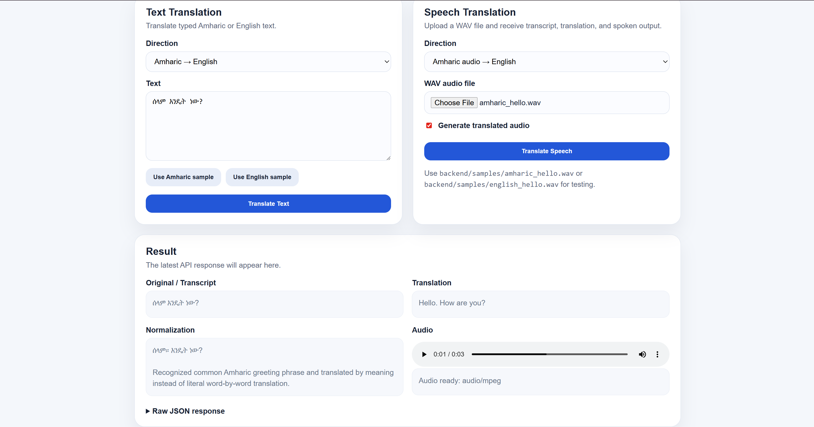

# AmharicVoice AI

AmharicVoice AI is an Azure-powered Amharic ↔ English speech and text translation project. It is designed to support Amharic speakers, English speakers, and Ethiopian/Eritrean communities with a practical AI translation assistant that can process text, transcribe speech, translate meaning, and generate spoken audio output.

This project is being developed as a flagship portfolio project focused on cloud AI integration, backend API development, language-aware product design, and security-conscious handling of cloud credentials and generated audio.

---

## Demo Screenshot



---

## Project Status

**Current stage:** Local backend MVP with web UI working.

The project currently supports:

- English ↔ Amharic text translation
- Amharic speech-to-text from WAV audio
- English speech-to-text from WAV audio
- Speech transcript translation
- Text-to-speech MP3 generation
- Clean audio URL responses
- Amharic phrase normalization for common greeting patterns
- Local browser-based web UI
- FastAPI Swagger/OpenAPI testing through `/docs`
- GitHub documentation and demo screenshot
- Basic API rate limiting for local MVP protection
- Speech upload size limits with chunked file reading

## Public Demo

The AmharicVoice AI MVP is deployed on Render.

- Frontend demo: `https://amharic-voice-ai-web.onrender.com`
- Backend health endpoint: `https://amharic-voice-ai.onrender.com/health`
- Backend API docs: `https://amharic-voice-ai.onrender.com/docs`

### Demo Notes

- Text translation can be tested directly in the frontend demo.
- Speech translation requires a valid WAV/PCM audio file.
- Renamed `.m4a`, `.mp3`, or compressed audio files are not valid WAV files and will be rejected.
- The backend is hosted on Render’s free tier, so the first request after inactivity may take about a minute while the service wakes up.
- Azure API keys are stored as Render environment variables and are not committed to GitHub.
- The deployed frontend calls the deployed backend API over HTTPS.

Current audio upload limitation:

- The speech endpoint expects real WAV/PCM audio.
- Renaming a compressed file such as `.m4a` to `.wav` does not make it a valid WAV file.
- The final MVP goal is to record directly into an Azure-compatible WAV/PCM format so users do not need to manually convert recordings.

---

## Problem Statement

Many modern AI products provide stronger support for widely used global languages than for Amharic. Basic translation tools can also translate Amharic too literally, missing the conversational meaning of common expressions.

During testing, the phrase:

```text
ሰላም እንዴት ነው?
```

was originally translated as:

```text
How is peace?
```

That translation is too literal because `ሰላም` can mean “peace,” but in this context it functions as a greeting. The improved output is:

```text
Hello. How are you?
```

This project adds an Amharic-aware normalization layer so the app can handle common conversational patterns more naturally instead of relying only on direct word-by-word translation.

---

## Key Features

### Text Translation

The backend supports text translation in both directions:

| Direction | Meaning |
|---|---|
| `am-en` | Amharic text → English text |
| `en-am` | English text → Amharic text |

### Speech Translation

The backend accepts WAV audio uploads and performs the following workflow:

```text
User uploads Amharic or English WAV audio
→ Backend sends audio to Azure Speech-to-Text
→ Backend translates the transcript with Azure Translator
→ Backend generates translated speech with Azure Text-to-Speech
→ Backend returns transcript, translation, normalization details, and audio URL
```

### Supported Audio Format

For the current MVP, uploaded speech audio should be a real WAV/PCM file.

Recommended recording format:

```text
WAV
PCM
16-bit
Mono
16 kHz sample rate


User clicks Record
→ Browser or mobile app captures microphone audio
→ App encodes the recording as 16 kHz mono 16-bit PCM WAV
→ App uploads the WAV file directly to the speech translation endpoint
→ User receives transcript, translation, and translated speech output


### Amharic Phrase Normalization

The app includes custom phrase normalization logic for common Amharic greetings.

Example successful API response:

```json
{
  "direction": "am-en",
  "speech_locale": "am-ET",
  "source_language": "am",
  "target_language": "en",
  "transcript": "ሰላም እንዴት ነው?",
  "translated_text": "Hello. How are you?",
  "normalized_text": "ሰላም። እንዴት ነው?",
  "normalization_applied": true,
  "normalization_note": "Recognized common Amharic greeting phrase and translated by meaning instead of literal word-by-word translation.",
  "audio_url": "/audio/translation_example.mp3",
  "audio_mime_type": "audio/mpeg"
}
```

### Clean Audio Output

The first version returned a large `audio_base64` string in the JSON response. The backend was improved to save generated MP3 files locally and return a clean `audio_url` instead.

Example:

```json
{
  "audio_url": "/audio/translation_example.mp3",
  "audio_mime_type": "audio/mpeg"
}
```

---

## Tech Stack

| Area | Technology |
|---|---|
| Backend | FastAPI |
| Language | Python |
| Cloud AI | Azure Speech Services |
| Translation | Azure Translator |
| Speech-to-text | Azure Speech SDK |
| Text-to-speech | Azure Speech SDK |
| Frontend | HTML, CSS, JavaScript |
| API testing | FastAPI Swagger UI |
| Environment management | Python virtual environment |
| Secrets management | `.env` file for local development |

---

## Architecture

```text
Client or browser
    ↓
FastAPI backend
    ↓
Azure Speech-to-Text
    ↓
Amharic/English phrase normalization
    ↓
Azure Translator
    ↓
Azure Text-to-Speech
    ↓
Generated MP3 audio URL
```

---

## Folder Structure

```text
backend/
  app/
    config.py
    main.py
    models.py
    normalizer.py
    speech.py
    translator.py
  scripts/
    make_test_audio.py
  requirements.txt
  .gitignore

docs/
  AZURE_SETUP.md
  PRIVACY_SECURITY.md
  PRODUCT_PLAN.md
  PROJECT_LOG.md
  TEST_PLAN.md
  screenshots/
    web-ui-combined-demo.png

frontend/
  index.html
  styles.css
  app.js

mobile-ios/
  SwiftUI starter files

.env.example
README.md
```

---

## Backend Setup, Windows

From the repository root:

```powershell
cd backend
py -3.12 -m venv .venv
.\.venv\Scripts\Activate.ps1
python -m pip install --upgrade pip setuptools wheel
pip install -r requirements.txt
```

Create a local `.env` file inside the `backend` folder:

```powershell
notepad .env
```

Use this format:

```env
AZURE_SPEECH_KEY=your_speech_key_here
AZURE_SPEECH_REGION=eastus

AZURE_TRANSLATOR_KEY=your_translator_key_here
AZURE_TRANSLATOR_REGION=global
AZURE_TRANSLATOR_ENDPOINT=https://api.cognitive.microsofttranslator.com

APP_ENV=development
ALLOWED_ORIGINS=*
```

Start the backend:

```powershell
python -m uvicorn app.main:app --reload --reload-dir app --host 127.0.0.1 --port 8000
```

Open the health endpoint:

```text
http://127.0.0.1:8000/health
```

Expected response:

```json
{
  "status": "ok",
  "service": "amharic-voice-ai"
}
```

---

## Frontend Setup, Windows

In a second PowerShell window, from the repository root:

```powershell
cd frontend
py -3.12 -m http.server 5500 --bind 127.0.0.1
```

Open:

```text
http://127.0.0.1:5500
```

---

## API Documentation

FastAPI provides interactive local API documentation at:

```text
http://127.0.0.1:8000/docs
```

Use this page to test:

- `/health`
- `/api/text-translate`
- `/api/speech-translate`

---

## Test Text Translation

Example request body for Amharic to English:

```json
{
  "text": "ሰላም እንዴት ነው?",
  "direction": "am-en"
}
```

Example request body for English to Amharic:

```json
{
  "text": "Hello, how are you?",
  "direction": "en-am"
}
```

---

## Test Speech Translation

Use generated test audio files or upload your own valid WAV/PCM files.

Example values in `/docs`:

| Field | Value |
|---|---|
| `direction` | `am-en` |
| `speak_output` | `true` |
| `audio` | `amharic_hello.wav` |

The response should include:

- Transcript
- Translated text
- Normalized text, if applicable
- Normalization status
- Audio URL
- Audio MIME type

---

### Audio Upload Troubleshooting

If a speech upload fails with an invalid audio header error, check that the uploaded file is a real WAV/PCM file. A file recorded as `.m4a` and renamed to `.wav` will still fail because the internal audio encoding did not change.

Use the generated sample files first to confirm the backend is working:

```text
backend/samples/english_hello.wav
backend/samples/amharic_hello.wav

## Generated Test Audio

A helper script is included to generate sample WAV files using Azure Text-to-Speech.

From the `backend` folder:

```powershell
python .\scripts\make_test_audio.py
```

Expected generated files:

```text
samples/english_hello.wav
samples/amharic_hello.wav
```

These files make it possible to test the speech pipeline without using a microphone.

---

## Security and Privacy Notes

This project is currently a local development MVP. It should not be deployed publicly without additional protections.

Current practices:

- Azure API keys are stored in `.env`.
- `.env` is ignored and should not be committed to GitHub.
- Generated audio files are ignored and should not be committed to GitHub.
- Generated WAV samples are ignored.
- Backend runs locally on `127.0.0.1` during development.
- Azure keys stay server-side and are not placed inside the iOS/mobile client.
- Git command-line commits use a GitHub noreply email for privacy.

Before public deployment, planned improvements include:

- Rate limiting
- Authentication or API access control
- HTTPS deployment
- Restricted CORS origins
- File size limits
- Audio file cleanup
- Logging policy that avoids storing sensitive speech/text
- Privacy notice for uploaded audio and translated text

---

## Portfolio Value

This project demonstrates:

- Cloud AI integration
- Backend API development
- Azure Speech Services
- Azure Translator
- Speech-to-text workflows
- Text-to-speech workflows
- Multilingual Unicode troubleshooting
- Amharic language support
- Rule-based NLP/phrase normalization
- Secure API key handling
- API usability improvements
- Product-minded AI development
- Security and privacy awareness

---

## Roadmap

### Phase 1, Backend MVP

- [x] Create FastAPI backend
- [x] Configure Azure Speech Services
- [x] Configure Azure Translator
- [x] Add text translation endpoint
- [x] Add speech translation endpoint
- [x] Generate test WAV files
- [x] Add Amharic phrase normalization
- [x] Replace base64 audio output with audio URL

### Phase 2, Local Web UI

- [x] Create browser interface
- [x] Add text translation panel
- [x] Add speech upload panel
- [x] Add audio player
- [x] Display transcript and translated text
- [x] Display normalization notes
- [x] Add screenshots for GitHub

### Phase 3, Security Hardening

- [x] Confirm `.env` is ignored
- [x] Add `.env.example`
- [x] Ignore generated audio, WAV samples, backup files, and test output
- [x] Review and merge Dependabot dependency update
- [x] Add rate limiting
- [x] Add upload file size limits
- [x] Improve upload size validation with chunked reads
- [x] Add clear invalid WAV error handling
- [x] Add generated audio cleanup
- [x] Restrict production CORS settings
- [x] Add privacy/security checklist

### Phase 4, Deployment

- [x] Choose deployment platform
- [x] Configure production environment variables
- [x] Deploy backend with HTTPS
- [ ] Test deployed API
- [ ] Add public demo instructions

### Phase 5, Mobile/Web App

- [ ] Build frontend/mobile prototype
- [ ] Add browser microphone recording
- [ ] Encode browser recordings as 16 kHz mono 16-bit PCM WAV
- [ ] Upload recorded WAV directly to the speech translation endpoint
- [ ] Add translated audio playback
- [ ] Prepare demo video
- [ ] Explore iOS app packaging

---

## Resume Summary

**AmharicVoice AI** is an Azure-powered Amharic ↔ English speech and text translation project built with FastAPI, Azure Speech Services, Azure Translator, and a local web UI. The project supports text translation, speech transcription, translated speech output, and Amharic-aware phrase normalization to improve natural translation quality for common conversational phrases.

---

## Current Status

The local backend and browser UI are working. The project is public on GitHub and being prepared for continued security hardening, deployment planning, and portfolio use.
